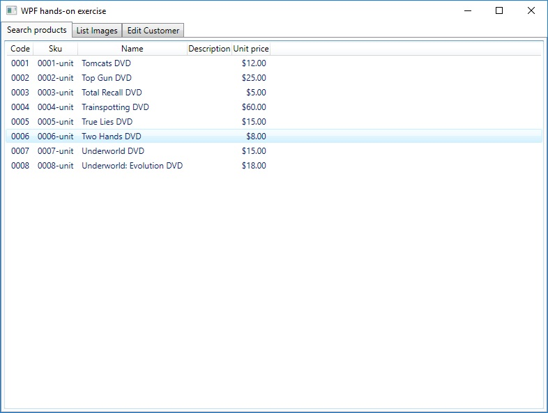
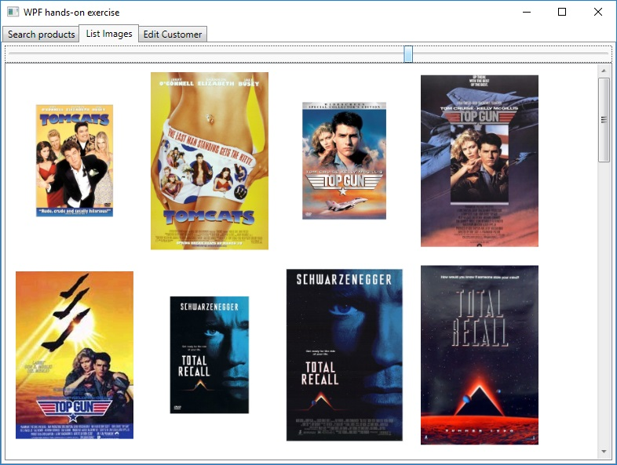
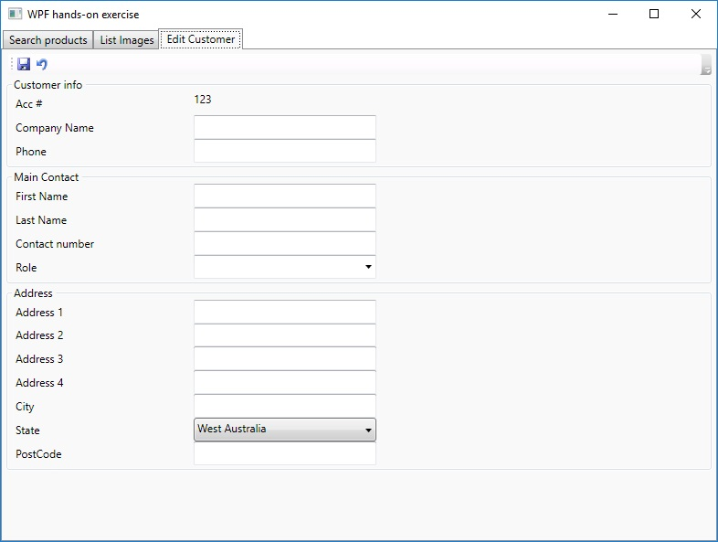
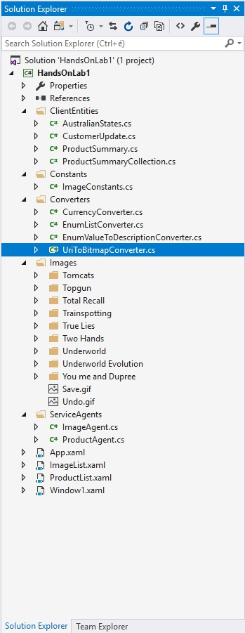

# Windows Presentation Foundation hands-on exercise
The intention of this hands-on-lab is to get a developer producing initial WPF and XAML code that may be used in a live environment.

## Description
We will start with a part complete solution. This solution will have one project that has the required Entities, Services and resources ready. We will take the project and complete it in about 2 hours so it looks like the following:

### We will cover the following points, concepts and techniques:
* Adding user controls to other controls/windows
* Use three different types of panel/layout control.
* Formatting Lists of data
* Binding to data to an ItemsControl
* Use a Converter
* Declare resources for a control
* Create and implement a data template inline and as a static resource
* Bind to a DependancyObject (Bind one control to another control)
* Xml namespaces
* Creating a UserControl from scratch
* Adding a CommandBinding
* Bind to a Enum
* Create and implement styles
* Use Commands for existing functionality
* Use GroupBoxes

### The solution:
To cut to the chase the solution already exits with the basics to get you started so we can focus on just the WPF and the XAML. We have some entities that we can use to hold data, some predefined converters, images to display and some service agents to get us our mock data. There is also 4 xaml files. The app.xaml is standard for WPF applications and usually just defines the StartupURI. In our case this Uri points to Window.xaml which will be our main window. Window.xaml, ProductSearch.xaml and ImageList.xaml are stubs that contain some half built xaml files. We will create another xaml file for the Customer Edit later in the lab.

